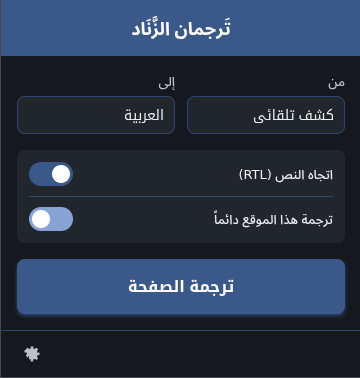

# تَرجمان الزَّنَاد 

تَرجمان الزَّنَاد هو إضافة متصفح متطورة مصممة لتوفير تجربة ترجمة فورية وسلسة، مع تركيز خاص على تحسين قراءة النصوص العربية. تهدف الإضافة إلى سد الفجوة اللغوية وتسهيل تصفح المحتوى العالمي بلغة الضاد.

## المميزات الرئيسية

*   **ترجمة شاملة وفورية:** ترجمة صفحات الويب بالكامل بنقرة واحدة باستخدام محركات ترجمة قوية (Google Translate, Yandex).
*   **دعم فائق للـ RTL:** تعديل اتجاه النص تلقائياً (من اليمين إلى اليسار) للمواقع التي لا تدعم العربية بشكل جيد، مما يضمن تجربة قراءة مريحة.
*   **نظام ترجمة ذكي:**
    *   **النمط الغامر (Immersive Mode):** عرض الترجمة بجانب النص الأصلي للحفاظ على السياق.
    *   **نمط الاستبدال:** استبدال النص الأصلي بالترجمة مباشرة.
*   **أداء عالي:** استخدام نظام ذاكرة مؤقتة (Cache) متطور لتسريع عملية الترجمة وتقليل استهلاك البيانات.
*   **تخصيص كامل:**
    *   إدارة المواقع المستثناة من الترجمة أو الـ RTL.
    *   تفعيل الترجمة التلقائية لمواقع محددة أو لجميع المواقع.
    *   اختيار مزود الخدمة المفضل.
*   **أداة الترجمة السريعة:** مساحة مخصصة في صفحة الإعدادات لترجمة النصوص السريعة والنسخ الفوري.
*   **اختصارات لوحة المفاتيح:** دعم كامل للتنقل والتحكم عبر لوحة المفاتيح.

## التثبيت والتشغيل

1.  قم بتحميل مستودع المشروع على جهازك.
2.  افتح متصفحك.
3.  انتقل إلى "إدارة الإضافات".
4.  قم بتفعيل **وضع المطور (Developer mode)** من الزاوية العلوية.
5.  اضغط على **تحميل إضافة** أو قم مباشرة بسحب المجلد إلى الصفحة.

## الهيكل المعماري للمشروع

يتبع المشروع نهجاً نموذجياً (Modular) لضمان سهولة الصيانة والتوسع:

*   **`background/`**: يحتوي على الخدمة الخلفية (Service Worker) التي تدير عمليات الترجمة والتواصل مع المتصفح.
*   **`content/`**: البرمجيات التي تُحقن في صفحات الويب لإدارة جمع النصوص وتطبيق الترجمات.
*   **`ui/`**: واجهات المستخدم (النافذة المنبثقة وصفحة الإعدادات).
*   **`modules/`**: وحدات برمجية متخصصة (قاعدة البيانات، معالج النصوص، المراقب، إلخ).

## التقنيات المستخدمة

*   **Manifest V3:** أحدث معايير إضافات المتصفح لضمان الأمان والأداء.
*   **Vanilla JavaScript (ES6+):** برمجة نظيفة بدون مكتبات خارجية ثقيلة.
*   **CSS3:** واجهات مستخدم متجاوبة تدعم الوضع الليلي والـ RTL بشكل أصيل.
*   **Chrome Storage API:** لإدارة الإعدادات والذاكرة المؤقتة.

## رخصة المشروع
هذا المشروع متاح تحت رخصة مفتوحة المصدر للاستخدام الشخصي والتطوير.
